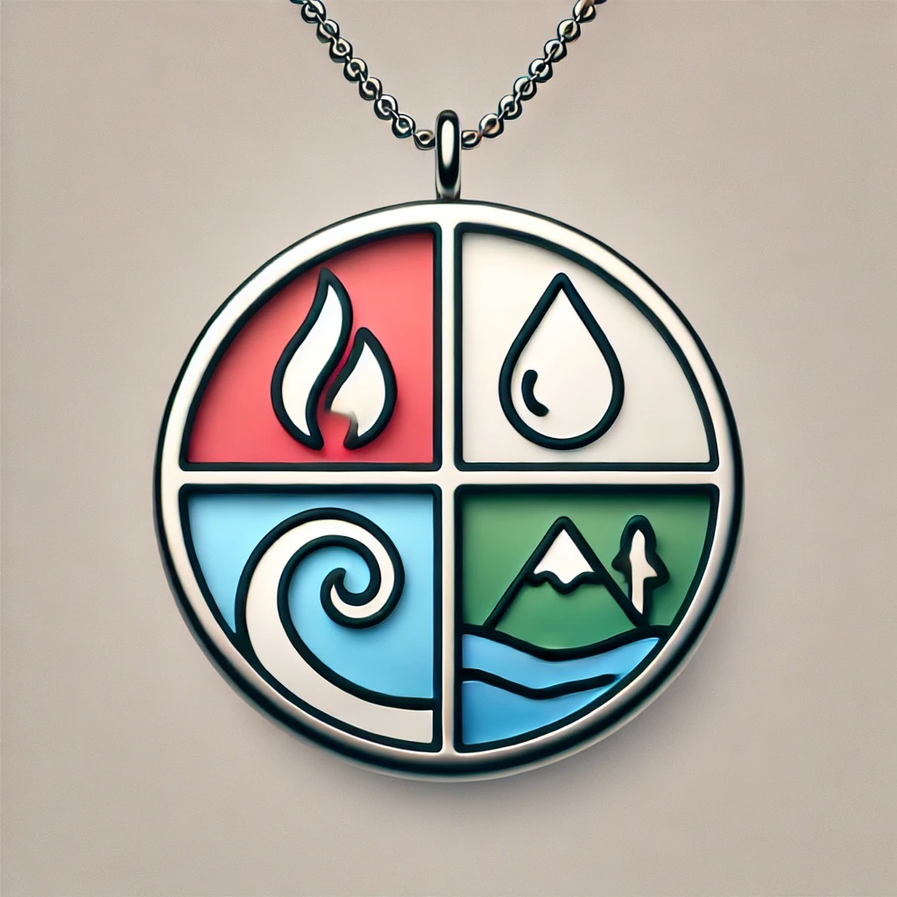

# Elements Wearable

Welcome to **Elements Wearable**, a project focused on developing innovative wearable devices that combine cutting-edge technology with user-centric design. Our mission is to create devices that seamlessly integrate into daily life while providing impactful features for users.

## About Elements Wearable

Our current focus is on:

- Developing a wearable device leveraging the Seeed Studio XIAO nRF52840 Sense board.
- Features include:
  - IMU-based activity tracking.
  - Audio data capture and transmission using BLE.
  - Low power consumption with real-time battery monitoring.
- Delivering solutions that are scalable, efficient, and adaptable to user needs.

## Contributing

We welcome contributions from the community. Please follow our [Code of Conduct](../CODE_OF_CONDUCT.md) to ensure a welcoming environment for everyone. Stay tuned for contribution guidelines as we structure the project further.

## License

This project is licensed under the [MIT License](../LICENSE). See the LICENSE file for details.

---

Thank you for your interest in Elements Wearable.
Together, let's build something remarkable!
